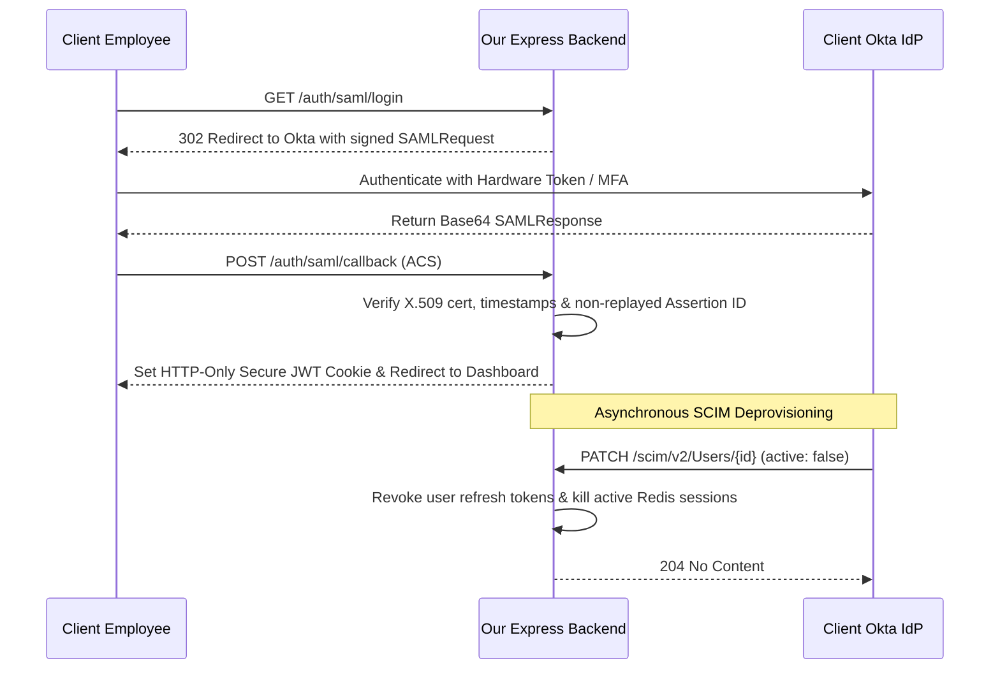

# Forward Deployed Engineer (FDE) Real-World Enterprise Mission Labs
## 6 Production Simulation Scenarios with Code, Configurations & Forensic Triage

---

## Mission Lab 1: Air-Gapped Banking Cluster Deployment
**Scenario:** A Tier-1 Global Investment Bank requires your containerized microservices platform deployed into their offline, air-gapped private OpenShift / Kubernetes cluster. The cluster has **zero outbound internet access** (no Docker Hub, no public npm, no GitHub).

### Architectural Topology
```
DEVELOPMENT (Connected Environment)          AIR-GAPPED CUSTOMER VPC (Isolated)
+------------------------------------+       +------------------------------------+
| 1. Docker Build & Multi-Arch Image |       | 4. Customer Private Harbor Registry|
| 2. `docker save` to tarball bundle | =====>|    registry.internal.bank:5000     |
| 3. Local Helm Packaging (.tgz)     | Sneak |                 ^                  |
|    with SHA-256 Signatures         | ernet |                 | pull             |
+------------------------------------+       | 5. Offline Kubernetes Worker Nodes |
                                             |    - Deploy via local Helm values  |
                                             +------------------------------------+
```

### Lab Deliverables & Tasks
1. **Asset Export Script (`export-airgap-bundle.sh`):**
   Write a shell script that pulls target images, saves them to a compressed tar archive, packages the Helm chart with dependencies vendored locally, and generates a SHA-256 checksum manifest.
2. **Local Registry Ingestion (`import-airgap-bundle.sh`):**
   Write a script that validates SHA-256 signatures, loads the tarball into local docker daemon, tags all images with the target customer registry prefix (`registry.internal.bank:5000/enterprise-platform/`), and pushes them.
3. **Air-Gapped `values.yaml` Configuration:**
   Override all upstream image registries, enforce `imagePullPolicy: IfNotPresent`, and configure restrictive security contexts (`readOnlyRootFilesystem: true`, `runAsNonRoot: true`).

### Solution Code Template
```yaml
# helm/values-airgap-production.yaml
global:
  imageRegistry: "registry.internal.bank:5000/enterprise-platform"
  imagePullPolicy: "IfNotPresent"
  offlineMode: true

coreService:
  replicaCount: 3
  image:
    repository: "core-engine"
    tag: "v2.4.0"
  resources:
    limits:
      cpu: "2000m"
      memory: "4Gi"
    requests:
      cpu: "500m"
      memory: "1Gi"
  securityContext:
    readOnlyRootFilesystem: true
    runAsNonRoot: true
    runAsUser: 10001
    allowPrivilegeEscalation: false
    capabilities:
      drop: ["ALL"]
  env:
    - name: NODE_ENV
      value: "production"
    - name: OFFLINE_LICENSE_KEY_PATH
      value: "/etc/licenses/enterprise.lic"

networkPolicy:
  enabled: true
  egress:
    # Restrict egress strictly to customer internal DB and Redis
    - to:
        - ipBlock:
            cidr: 10.200.0.0/16
      ports:
        - protocol: TCP
          port: 5432
        - protocol: TCP
          port: 6379
```

---

## Mission Lab 2: Enterprise SAML 2.0 & SCIM Provisioning Engine
**Scenario:** Integrate an enterprise client's Okta Identity Provider (IdP) with your Node/Express SaaS platform. The integration must support SP-initiated SAML authentication with cryptographic signature validation and automated SCIM 2.0 user lifecycle provisioning.

### Architectural Flow


### Key Implementation (Express + SCIM Revocation Handler)
```typescript
// src/services/scim.service.ts
import { Request, Response } from 'express';
import { redisClient } from '../config/redis';
import { UserModel } from '../models/user.model';

export async function handleScimPatchUser(req: Request, res: Response) {
  const { id } = req.params;
  const { Operations } = req.body;

  // Validate SCIM Bearer token
  const authHeader = req.headers.authorization;
  if (!authHeader || authHeader !== `Bearer ${process.env.SCIM_BEARER_SECRET}`) {
    return res.status(401).json({ status: "401", detail: "Unauthorized SCIM request" });
  }

  const user = await UserModel.findById(id);
  if (!user) {
    return res.status(404).json({ status: "404", detail: "User not found in directory" });
  }

  // Check for deactivation operation
  const deactivationOp = Operations.find(
    (op: any) => op.op.toLowerCase() === 'replace' && (op.path === 'active' || op.value?.active === false)
  );

  if (deactivationOp) {
    user.isActive = false;
    user.deactivatedAt = new Date();
    await user.save();

    // Kill all active user sessions instantly in Redis
    await redisClient.del(`session:${user.id}`);
    await redisClient.sadd('revoked_tokens', user.activeTokenFamily);

    console.log(`[SCIM] Successfully deactivated enterprise user: ${user.email}`);
  }

  return res.status(200).json({
    schemas: ["urn:ietf:params:scim:schemas:core:2.0:User"],
    id: user.id,
    userName: user.email,
    active: user.isActive
  });
}
```

---

## Mission Lab 3: Resilient Reverse ETL & CDC Pipeline
**Scenario:** An enterprise customer has an existing Oracle / PostgreSQL database committing 150,000 order changes per hour. Your platform must stream these changes in near real-time into an analytical Snowflake/ClickHouse warehouse with **zero data loss** and **automatic schema drift reconciliation**.

### Pipeline Topology
```
[Postgres WAL] -> [Debezium Kafka Connector] -> [Kafka Topic: cdc.orders] 
                     -> [FDE Ingestion Worker with DLQ] -> [ClickHouse / Postgres Warehouse]
```

### Failure Injection & Recovery
- **Scenario A: Schema Drift:** Customer adds a new column `loyalty_tier` to the database without informing you.
  - *Fix:* Ensure consumer deserializer ignores unmapped fields or automatically executes `ALTER TABLE` migrations on the analytical store via an automated schema sync daemon.
- **Scenario B: Duplicate Records:** Kafka rebalance replays 1,500 unacknowledged messages.
  - *Fix:* Use deterministic idempotency keys: `idempotency_key = sha256(order_id + lsn + event_timestamp)`. Use PostgreSQL `INSERT INTO orders (...) VALUES (...) ON CONFLICT (order_id) DO UPDATE SET ... WHERE excluded.tx_timestamp >= orders.tx_timestamp`.

---

## Mission Lab 4: Zero-Trust Bastion Triage Under PII Restrictions
**Scenario:** A client in the healthcare industry running in a restricted AWS GovCloud VPC reports that your microservice is experiencing sporadic timeouts (p99 latency 4.2 seconds). You are granted temporary SSH access to a bastion jump host.
**Constraints:**
1. Zero internet connectivity on the bastion.
2. Viewing patient data (HIPAA PII) in logs is a federal compliance violation.

### Triage Step-by-Step Playbook
1. **Check System Load & CPU Throttling:**
   ```bash
   top -b -n 1 | head -n 20
   cat /sys/fs/cgroup/cpu/cpu.stat
   # Look for nr_throttled: if high, Kubernetes CFS quota is starving the process.
   ```
2. **Inspect Sockets & Connection Pools:**
   ```bash
   ss -s
   # Output analysis:
   # TCP: 35200 (estab 120, closed 34980, orphaned 0, timewait 34500)
   # ROOT CAUSE FOUND: 34,500 connections in TIME_WAIT! Port exhaustion occurring.
   ```
3. **Verify DNS Latency without PII Exposure:**
   ```bash
   dig +trace +stats db-cluster.internal.bank
   # Check if query time exceeds 10ms or if NXDOMAIN loops occur.
   ```
4. **Remediation Action:**
   Configure connection pooling keep-alive on the application HTTP client and tune Linux kernel ephemeral socket reuse:
   ```bash
   sudo sysctl -w net.ipv4.tcp_tw_reuse=1
   ```

---

## Mission Lab 5: Enterprise LLM / RAG Pipeline with Fine-Grained Security ACLs
**Scenario:** Deploy a custom Enterprise AI Assistant powered by an LLM over a Fortune 500 company's internal document repository (200,000 PDF documents across HR, Finance, Engineering, and Executive Board).

### Security Requirement
When a user asks a question, the vector similarity engine must **only** retrieve document chunks that the user's specific LDAP / Okta security groups have clearance to view.

### Database Schema & Query Implementation (PostgreSQL + pgvector)
```sql
-- 1. Create document chunk store with vector embedding & ACL array
CREATE EXTENSION IF NOT EXISTS vector;

CREATE TABLE enterprise_document_chunks (
    id UUID PRIMARY KEY DEFAULT gen_random_uuid(),
    document_id VARCHAR(64) NOT NULL,
    tenant_id VARCHAR(64) NOT NULL,
    content TEXT NOT NULL,
    embedding vector(1536), -- OpenAI text-embedding-3-small or ada-002
    allowed_security_groups TEXT[] NOT NULL, -- e.g. ['GRP_FINANCE', 'GRP_EXEC']
    created_at TIMESTAMP WITH TIME ZONE DEFAULT NOW()
);

-- Create HNSW index for sub-5ms cosine vector similarity
CREATE INDEX idx_document_embedding_hnsw 
ON enterprise_document_chunks 
USING hnsw (embedding vector_cosine_ops)
WITH (m = 16, ef_construction = 64);

-- 2. Secure Filtered Search Query
-- $1: Query Vector [0.012, -0.043, ...]
-- $2: User Tenant ID 'corp-alpha'
-- $3: User LDAP Groups ARRAY['GRP_ENGINEERING', 'GRP_ALL_EMPLOYEES']
SELECT 
    id,
    content,
    1 - (embedding <=> $1) AS cosine_similarity
FROM enterprise_document_chunks
WHERE tenant_id = $2
  AND allowed_security_groups && $3 -- Array Overlap Operator
ORDER BY embedding <=> $1
LIMIT 5;
```

---

## Mission Lab 6: Mission-Critical Incident Post-Mortem & Executive Defense
**Scenario:** During a major retail client's Black Friday event, a race condition in the distributed inventory sync service caused 120 customers to purchase the same out-of-stock flagship product. The client's Chief Technology Officer has summoned you to an emergency executive review with potential SLA financial penalty implications.

### Deliverables Required
1. **Immediate Executive Status Statement:**
   Draft a calm, authoritative incident response update for the client CTO.
2. **Root Cause Analysis (RCA) Diagram:**
   Illustrate the race condition between the distributed read and atomic update.
3. **Corrective & Preventative Action (CAPA) Plan:**
   - Architectural remediation: Migrate from read-modify-write to Redis Lua script atomic decrement with monotonic fencing tokens.
   - Database safeguard: PostgreSQL `CHECK (inventory_count >= 0)`.
   - Client compensation & SLA reconciliation memo.
